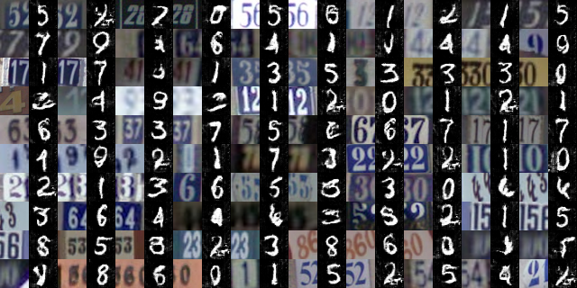

# tensorflow-DTN

A Tensorflow implementation of Domain Transfer Network [1].



# Usage
To train the model:

```
cd data/
chmod +x download.sh & ./download.sh
cd ../
python main.py
```

# Reference
[1] Yaniv Taigman, Adam Polyak and Lior Wolf, *Unsupervised Cross-Domain Image Generation*

# Acknowledgments
This project gets inspirations from the following projects:
- [domain-transfer-network](https://github.com/yunjey/domain-transfer-network)
- [domain-transfer-net](https://github.com/davrempe/domain-transfer-net)
